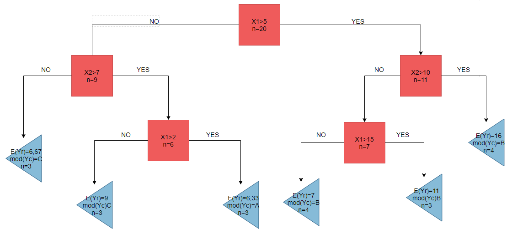

```{r setup, include=FALSE}
knitr::opts_chunk$set(echo = TRUE)
```


```{r setupo, warning=FALSE, message=FALSE}
knitr::opts_chunk$set(echo = TRUE)

library(knitr)
library(kableExtra)

library(dplyr)
library(ggplot2)

library(modeest)
library(rpart)
library(rpart.plot)
library(ISLR)
library(randomForest)
```

## Ejercicio 2

Genero un data frame auxiliar con las observaciones de la tabla y figura agrupadas:

```{r}
data <- tibble(
  id = as.character(1:20),
  yr = c(5, 7, 33, 22, 6, 12, 16, 2, 17, 9, 1, 3, 5, 7, 5, 3, 16, 12, 9, 1),
  yc = c("A", "A", "C", "B", "B", "B", "C", "B", "A", "C", "C", "C", "B", "B", "A","A", "A", "B", "C", "C")
  ) %>% 
  mutate(grupo = case_when(id %in% c(3, 6, 14, 18) ~ "Grupo 1",
                           id %in% c(2, 10, 16)    ~ "Grupo 2",
                           id %in% c(9, 11, 19)    ~ "Grupo 3",
                           id %in% c(12, 17, 20)   ~ "Grupo 4",
                           id %in% c(1, 7, 8, 13)  ~ "Grupo 5",
                           id %in% c(4, 5, 15)     ~ "Grupo 6"))
```


Muestro los valores promedio de la variable continua y la moda de la variable de clasificación, para cada grupo según la Figura 1:

```{r}
data %>% 
  group_by(grupo) %>% 
  summarise(valor  = mean(yr),
            clasif = mfv(yc)) %>% 
  kbl(caption = "Valores predichos por grupo", digits = 2) %>%
  kable_classic_2(full_width = F)
```


#### 1) Con las particiones de la Figura 1 dibuja la estructura del árbol de regresión asociado.


#### 2) Para una nueva observación X1 = 10 y X2 = 13 cuál es el valor predicho de YR por el árbol de regresión.
Para *X1=10* y *X2=13* el árbol de regresión predice **YR=16**, ya que la observación pertenece al grupo 1.

#### 3) ¿Cuál es el valor predicho de YC por el árbol de clasificación si X1 = 4 y X2 = 8?
Para *X1=4* y *X2=8* el árbol de clasificación predice **YC=A**, ya que la observación pertenece al grupo 2.


## Ejercicio 3

#### 1) ¿Cuál es la probabilidad que la primer observación de la muestra *bootstrap* sea la primer observación de los datos? Justifique la respuesta.
La probabilidad de que coincidan la primera observacion de la muestra y del *bootrsap* es $1/n$, ya que se trata de un muestreo aleatorio, es decir probabilidad clásica, nº de casos favorables/nº de casos posibles.

#### 2) Argumente que la probabilidad que la *j*-ésima observación no esté en la muestra bootstrap es $(1 - 1/n)^n$.
Como la muestra es con reposición la probabilidad de que una observación *j* no esté en la muestra es igual a la probabilidad de elegir cualquier otra observación = $(n-1)/n$, repetido cada vez que se selecciona una observación, es decir *n* veces: $[(n-1)/n]^n=(1-1/n)^n$.        

Esta probabilidad es creciente y acotada.

#### 3) Genere un gráfico que muestre para cada valor de *n* de 1 a 100, la probabilidad de que la observación *j*-ésima esté en la muestra *bootstrap*. Comente lo que se observa.

```{r}
otra.muestra.bootstrap <- tibble(
  n   = 1:100,
  prob_no = ((n-1)/n)^n,
  prob_si = 1-prob_no
)
```

La probabilidad de la *j*-ésima observación de si quedar en la muestra a medida que aumenta n, es igual a *1-prob-no*, por lo que es decreciente y acotada.

```{r, echo=FALSE}
ggplot(data=otra.muestra.bootstrap, aes(x=n, y=prob_si))+
  geom_point(alpha = 0.5)+
  scale_y_continuous(limits = c(0,1))+
  theme_bw()+
  ggtitle('Probabilidad de aparecer en el remuestreo')
```

A medida que aumenta el número de observaciones la probabilidad de aparecer en el muestreo se acerca rápidamente a su cota inferior.

## Ejercicio 4

```{r}
data_cs <- ISLR::Carseats
```

#### 1) Dividir los datos en un conjunto de **entrenamiento** y un conjunto de **control**.

Subseteo 300 observaciones para *train* y 100 para *test* según muestra al azar:

```{r}
set.seed(2021)
intrain <- sample(x=1:400, size=300)

train <- data_cs[intrain,]
test  <- data_cs[-intrain,]  
```

#### 2) Ajustar un árbol de regresión utilizando la biblioteca *rpart* a los datos de entrenamiento y estimar el error de generalización del modelo.

Primero ajusto el árbol de regresión con el modelo incluyendo todas las variables:
```{r}
sales_tree <- rpart::rpart(Sales ~ CompPrice + Income + Advertising + Population + Price + ShelveLoc + Age + Education + Urban + US, 
                           data=train)

rpart.plot(sales_tree, digits=3, cex=.6)
```

 
    
Ahora estimo los valores predichos por el modelo en el conjunto de entrenamiento y de control, luego calculo el Error Cuadrático Medio (ECM) en cada uno y comparo:

```{r}
pred_train <- predict(sales_tree, newdata=train)
pred_test  <- predict(sales_tree, newdata=test)

ecm_train <- mean((pred_train-train$Sales)^2)
ecm_test  <- mean((pred_test-test$Sales)^2)
```

El ECM es de `r round(ecm_train, 3)` en el conjunto de entrenamiento y de `r round(ecm_test, 3)` en el de control.

#### 3) Utilizando validación cruzada determinar nivel óptimo complejidad y obtener un árbol podado. ¿En este caso, podar el árbol mejora error de generalización?

Comenzamos estimando el árbol de regresión con un parámetro de complejidad (*cp*) igual a cero y graficamos como evoluciona el error en relación al tamaño del árbol y el *cp*.

```{r}
sales_tree <- rpart(Sales ~ CompPrice + Income + Advertising + Population + Price + ShelveLoc + Age + Education + Urban + US,
                    data=train)

plotcp(sales_tree)
```

Vemos que el óptimo se alcanza para un árbol de tamaño 12, con un *cp=0.011*. Ahora vamos a podar el árbol:

```{r}
sales_tree_prune <- prune(sales_tree, cp = 0.011)
rpart.plot(sales_tree_prune, digits=3)
```

Volvemos a calcular los valores predichos y el error de predicción en el conjunto de testeo:

```{r}
pred_train_prune <- predict(sales_tree_prune, newdata=train)
pred_test_prune  <- predict(sales_tree_prune, newdata=test)

ecm_train_prune <- mean((pred_train_prune-train$Sales)^2)
ecm_test_prune  <- mean((pred_test_prune-test$Sales)^2)
```

Vemos que el ECM en el conjunto de entrenamiento es de `r round(ecm_train_prune, 3)` y en el de control de `r round(ecm_test_prune, 3)`. En ambos casos el ECM es mayor para el árbol podado, lo cual es esperable porque el árbol maximal es el que minimiza el ECM.

#### 4) Elige un árbol e interpreta los resultados

La elección del árbol va a depender de para que lo querramos usar. Si intentamos predecir utilizaremos el árbol que minimiza el error de predicción, es decir el primero con mayor complejidad. Por otro lado si queremos explicar o entender porque se dan los distintos niveles de ventas, el segundo árbol es más simple de entender ya que tiene menor complejidad, es decir menor cantidad de nodas. Personalmente prefiero este último ya que el error cuadrático medio crece poco (0.031) y se gana en simplicidad.

#### 5) Utilizando la biblioteca *randomForest* ajustar un bosque aleatorio a los datos de entrenamiento. Elegir el valor de *mtry* con validación cruzada.

Para ver cual es el valor de *mtry* que minimiza el ECM fuera de la muestra utilizar{e el comando *tuneRF*:

```{r}
tuneRF(x=data_cs[,2:11], y=data_cs[,1])
```

Según este criterio el OOB Error (Out Of Box Error) que minimiza con 10 variables.

```{r}
rf_modelo <- randomForest(Sales ~ CompPrice + Income + Advertising + Population + Price + ShelveLoc + Age + Education + Urban + US,
                          data = train, 
                          mtry = 10, 
                          importance = TRUE)
```

#### 6) Con el bosque seleccionado, analiza la importancia de las variables en el modelo.
```{r}
rf_modelo$importance
```

La columna *%IncMSE* reporta los valores del *Permutation Accuracy*, es decir cuanto crece el ECM cuando la variable en cuestión se cambia por otros valores escogidos al azar. Cuanto mayor es el incremento del ECM mayor es la importancia de la variable en cuestión para predecir el valor de la avriable dependiente fuera de la muestra. En este caso, la variable más importante es *ShelveLoc* es la más importante para predecir el valor de las ventas. Vale destacar que esta es la variable que se encuentra en el primer nodo de todos los árboles que estimamos. Las otras variables de imporancia son *Price* y *CompPrice* en menor medida.

El otro método para ver la importancia de las variables es el de *Node Impurity* pero está desaconsejado por arrojar resultados sesgados.

